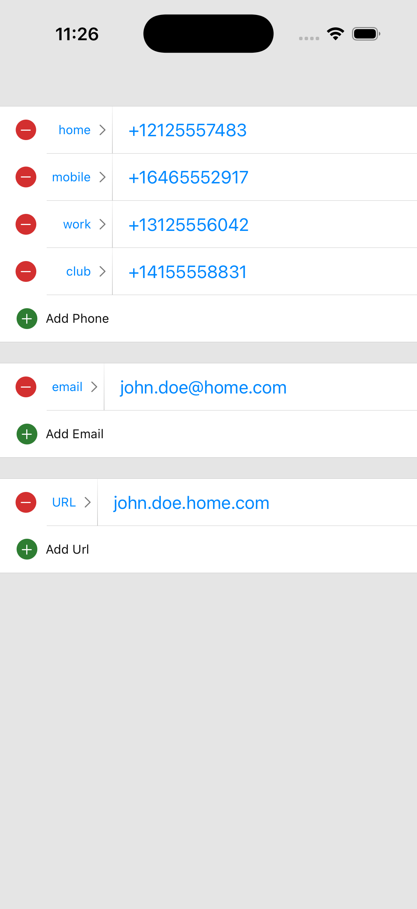
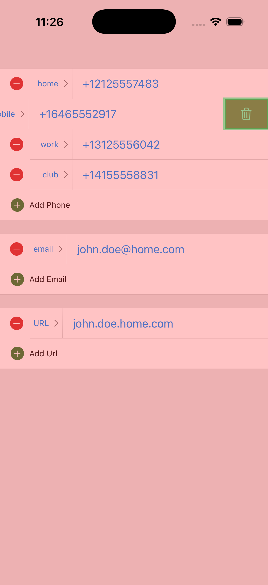

# NoFlyZone 🚫✈️

A SwiftUI modifier that creates an overlay to block user interactions everywhere except in specific authorized zones.

Perfect for swipe-to-delete patterns, edit modes, modals with specific action buttons, or any UI where you want to restrict interactions to designated areas.




## Features

- ✅ Block all screen interactions with a transparent overlay
- ✅ Define multiple authorized zones where interactions are still allowed
- ✅ Get callbacks when users tap inside or outside authorized zones
- ✅ Debug mode with visual zone highlighting
- ✅ Lightweight and easy to integrate

## Installation

### Swift Package Manager

Add NoFlyZone to your project via Xcode:

1. File → Add Package Dependencies
2. Enter package URL: `https://github.com/BaptisteSansierra/NoFlyZone`
3. Select version and add to your target

Or add it to your `Package.swift`:
```swift
dependencies: [
    .package(url: "https://github.com/BaptisteSansierra/NoFlyZone", from: "1.0.0")
]
```

## Usage

### Basic Example
```swift
import SwiftUI
import NoFlyZone

struct ContentView: View {
    @State private var isBlocking = false
    @State private var zone: CGRect = .zero
    
    var body: some View {
        VStack {
            Text("Swipe row to reveal delete")
            
            // Define some zone here
        }
        .noFlyZone(
            enabled: isBlocking,
            authorizedZones: [
                NoFlyZoneData(id: 0, zone: deleteButtonFrame)
            ],
            onAllowed: { zones in
                // User tapped inside an authorized zone
                print("Tapped: \(zones.first?.id ?? "unknown")")
                handleDelete()
            },
            onBlocked: {
                // User tapped outside authorized zones
                isBlocking = false
            }
        )
    }
}
```

### Swipe-to-Delete Pattern
```swift
struct SwipeToDeleteExample: View {
    @State private var items = ["Item 1", "Item 2", "Item 3"]
    @State private var revealedIndex: Int? = nil
    @State private var deleteButtonFrame: CGRect = .zero
    
    var body: some View {
        List {
            ForEach(items.indices, id: \.self) { index in
                ZStack(alignment: .trailing) {
                    // Delete button (hidden behind)
                    Button(action: {
                        deleteItem(at: index)
                    }) {
                        Image(systemName: "trash")
                            .foregroundColor(.white)
                            .frame(width: 80, height: 60)
                            .background(Color.red)
                    }
                    .background(
                        GeometryReader { geo in
                            Color.clear.onChange(of: revealedIndex) { _, _ in
                                if revealedIndex == index {
                                    deleteButtonFrame = geo.frame(in: .global)
                                }
                            }
                        }
                    )
                    
                    // Row content
                    Text(items[index])
                        .frame(maxWidth: .infinity, height: 60)
                        .background(Color.white)
                        .offset(x: revealedIndex == index ? -80 : 0)
                        .gesture(
                            DragGesture()
                                .onEnded { value in
                                    if value.translation.width < -50 {
                                        revealedIndex = index
                                    }
                                }
                        )
                }
            }
        }
        .noFlyZone(
            enabled: revealedIndex != nil,
            authorizedZones: [
                NoFlyZoneData(id: "delete", zone: deleteButtonFrame)
            ],
            onAllowed: { _ in
                // Delete button was tapped - handled by button itself
            },
            onBlocked: {
                withAnimation {
                    revealedIndex = nil
                }
            }
        )
    }
    
    private func deleteItem(at index: Int) {
        withAnimation {
            items.remove(at: index)
            revealedIndex = nil
        }
    }
}
```

### Debug Mode

Enable visual debugging to see authorized zones highlighted in green:
```swift
.noFlyZone(
    enabled: true,
    authorizedZones: zones,
    onAllowed: { _ in },
    onBlocked: { },
    coloredDebugOverlay: true  // Shows red overlay and green zones
)
```

## API Reference

### `NoFlyZoneData`

Defines an authorized zone where interactions are allowed.
```swift
public struct NoFlyZoneData: Identifiable, Equatable {
    public let viewId: Int
    public let itemId: Int
    public let zone: CGRect
}
```

- `viewId`: Unique identifier for the child view
- `itemId`: Unique identifier for the zone
- `zone`: The CGRect frame in global coordinates

### `noFlyZone` Modifier
```swift
func noFlyZone(
    enabled: Bool,
    authorizedZones: [NoFlyZoneData],
    onAllowed: @escaping ([NoFlyZoneData]) -> Void,
    onBlocked: @escaping () -> Void,
    coloredDebugOverlay: Bool = false
) -> some View
```

**Parameters:**
- `enabled`: Whether the no-fly zone overlay is active
- `authorizedZones`: Array of zones where taps are still allowed
- `onAllowed`: Callback with tapped zones when user interacts inside an authorized zone
- `onBlocked`: Callback when user interacts outside all authorized zones
- `coloredDebugOverlay`: Show visual debugging (red overlay, green zones)

## How It Works

1. When enabled, NoFlyZone places a transparent overlay over your entire view
2. The overlay blocks all touch events and gestures
3. You define authorized zones using `NoFlyZoneData` with global CGRect coordinates
4. When users tap inside an authorized zone, `onAllowed` is called with the zone data
5. When users tap outside all zones (or drag), `onBlocked` is called
6. You handle the callbacks to update your UI state accordingly

## Requirements

- iOS 17.0+
- macOS 14.0+
- Swift 5.9+

## Example Project

Check out the [Example](Example/) folder for a complete demo app showing various use cases

## License

NoFlyZone is available under the MIT license. See the LICENSE file for more info.

---

⭐️ If you find NoFlyZone useful, please give it a star on GitHub!
